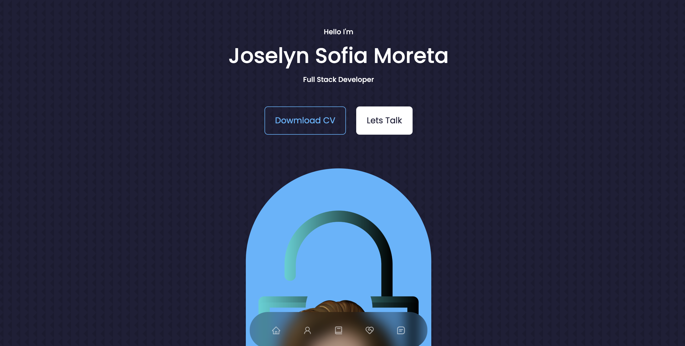
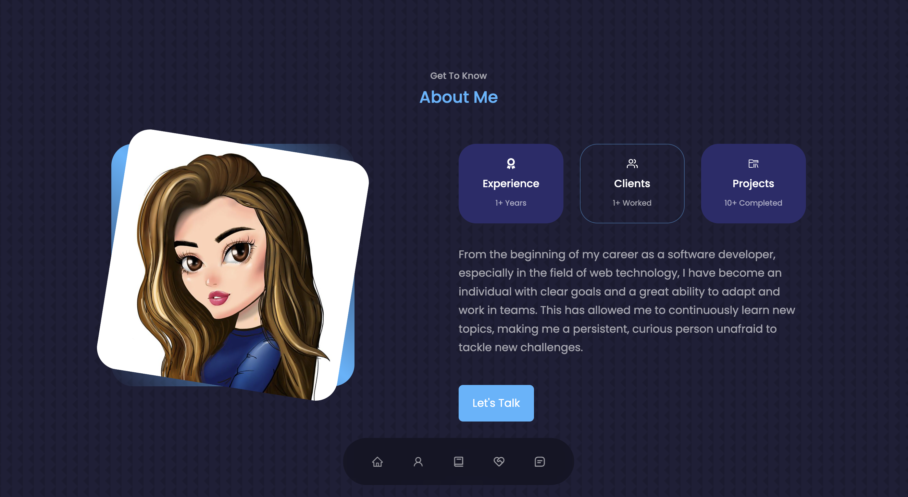
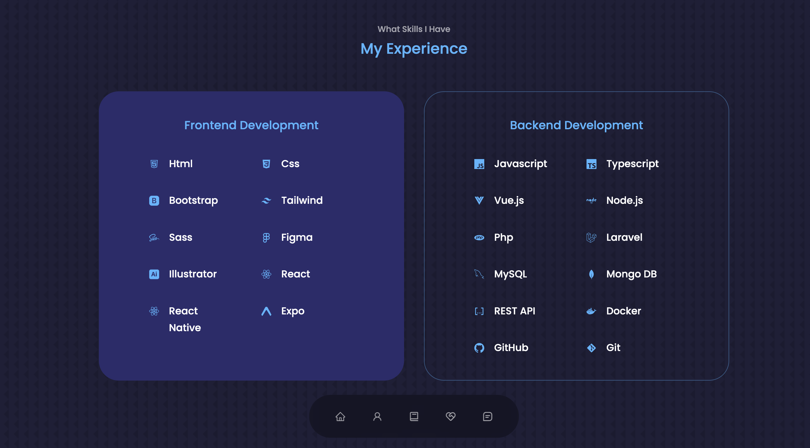
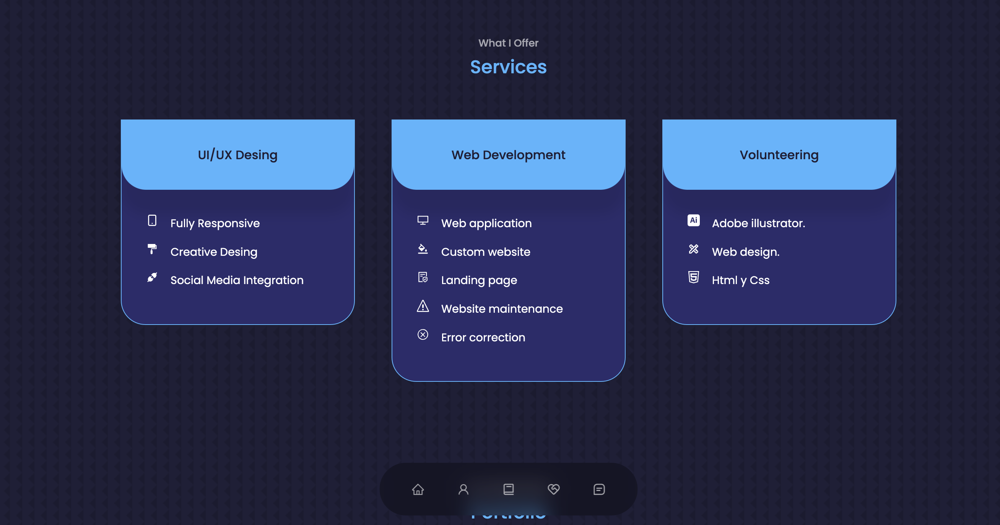
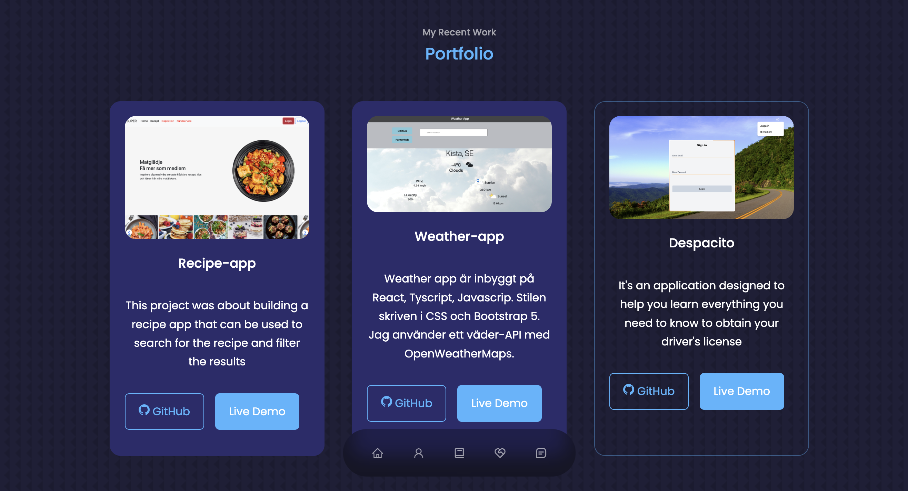
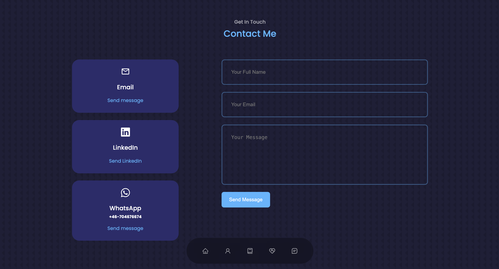

[](https://classroom.github.com/a/UfuEq6Ma)
[](https://classroom.github.com/online_ide?assignment_repo_id=11878035&assignment_repo_type=AssignmentRepo)

# Portfolio Web 👋 💻 🤓 🖥

<p>
In this archive you will find the source code for my portfolio.</p>
 
 
 
 
 
 
 


## Built with


[React](https://react.dev/)

[Vue JS](https://vuejs.org/)

[CSss](https://www.w3schools.com/css/)


## Getting Started

1. Clone the repository to your local files.

2. Install npm packages for both the front- and backend. Frontend files are located in the /frontend folder. Backend files are located in the root folder.
```bash
npm install
```

3. To start the Node server, in the root folder, run:

```bash
npm run dev
```


## License
Distributed under the MIT License. 

## Contact
```python
Author: Joselyn Moreta Guamanzara 
Email: joselyn.moreta@chasacademy.se
Lindedin: https://www.linkedin.com/in/sofia-moreta-8a5654265/
```


